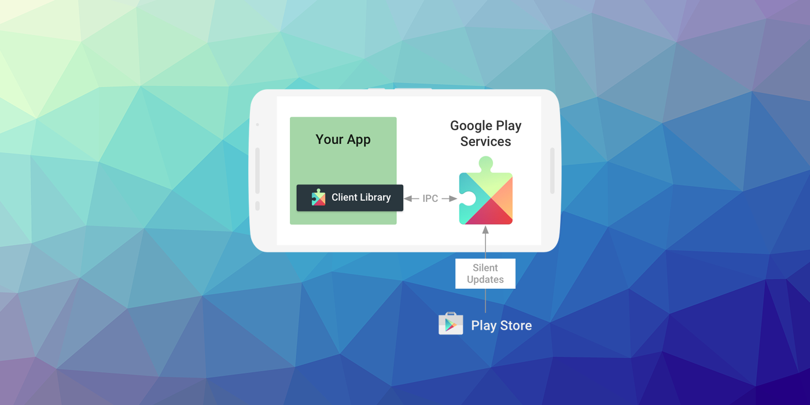

built by [distriqt //](https://airnativeextensions.com) 

# Google Play Services 

This repository contains a series of shared extensions that includes the Google Play Services Client Library and the Firebase Core library.

These are designed to be used in combination with the distriqt native extensions, however can be used as a dependency by any extension.

## The Google Play services client library

The client library contains the interfaces to the individual Google services and allows you to obtain authorization from users to gain access to these services with their credentials. 

It also contains APIs that allow you to resolve any issues at runtime, such as a missing, disabled, or out-of-date Google Play services APK. 

### Play Services ANEs

The Play Services ANEs package the Play Services client library into a form that you can package with your AIR application.
They are structured to make including the neccessary parts of the services client library in your application easy
and minimise the amount of dependent code by only including the parts of the client library your application requires.

The **Base** ANE contains the core functionality of the client library and is required by every other ANE as a dependency. 
Any of our ANEs that use Play services will require this ANE.

The other ANEs each represent a different component of the client library and you will include different ANEs 
depending on the functionality your application requires. 

Each of our other ANEs will outline exactly which of these play services ANEs, see the individual getting started
guides for more information.

## The Google Play services APK

The Google Play services APK contains the individual Google services and runs as a background service in the Android OS. 
You interact with the background service through the client library and the service carries out the actions on your behalf.
An easy-to-use authorization flow is also provided to gain access to the each Google service, 
which provides consistency for both you and your users.

The Google Play services APK is delivered through the Google Play Store, 
so updates to the services are not dependent on carrier or OEM system image updates. 
In general, devices running Android 2.3 (API level 9) or later and have the Google Play services app installed 
receive updates within a few days. 
This allows you to use the newest APIs in Google Play services and reach most of the devices in the Android ecosystem. 
Devices older than Android 2.3 or devices without the Google Play services app are not supported.

## Native Extensions

The highest quality and widest range of Native Extensions for Adobe AIR

With over 40 extensions available, we are the largest provider of native extensions for AIR developers.
Our mobile solutions allow developers to fast-forward development and focus on building great games and apps.

